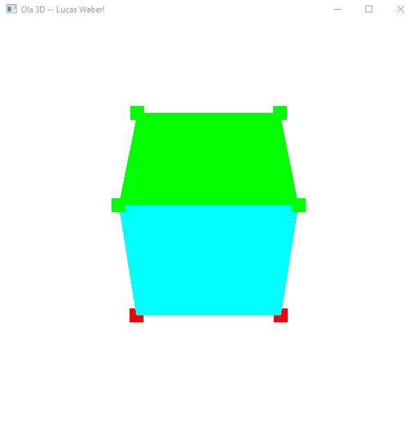

### Arquivo contendo os resultados das entregas
---
##### M1 - Alteração do nome da Janela do arquivo Hello3D.cpp

---
##### M2 - Criação de Cubo tridimensional que se movimenta nas 3 dimensões

O cubo rotaciona nas 3 dimensões por meio das teclas X, Y e Z. E se movimenta via WASD e IJ.

---

Ciência da Computação Unisinos, atividade acadêmica de Computação Gráfica - Lucas Weber - 2025.